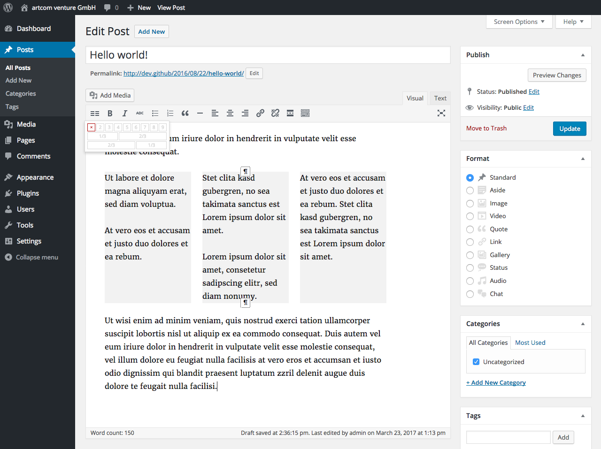
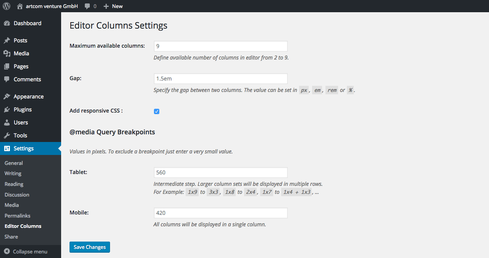

# WordPress HTML Editor Columns

Extends the WordPress HTML editor with columns ... **_the WYSIWYG way_**.

Insert multiple column sets with up to 9 columns directly into the HTML editor.

* no shortcodes
* no extra templates
* _customizable_ **responsive**

## Installation

1. Upload files to the `/wp-content/plugins/` directory of your WordPress installation.
  - Either [download the latest files](https://github.com/artcomventure/wordpress-plugin-columns/archive/master.zip) and extract zip (optionally rename folder)
  - ... or clone repository:
  ```
  $ cd /PATH/TO/WORDPRESS/wp-content/plugins/
  $ git clone https://github.com/artcomventure/wordpress-plugin-columns.git
  ```
  If you want a different folder name than `wordpress-plugin-columns` extend clone command by ` 'FOLDERNAME'` (replace the word `'FOLDERNAME'` by your chosen one):
  ```
  $ git clone https://github.com/artcomventure/wordpress-plugin-columns.git 'FOLDERNAME'
  ```
2. Activate the plugin through the 'Plugins' screen in WordPress.
3. **Enjoy**

## Usage

Once activated you'll find the columns button at the very left position of the first editor buttons row.



1. Select the text or position the cursor at the point where the columns should be inserted.
2. Click the columns button.
3. Choose number of columns.
4. Edit content.

To change the number columns of an existing set or to remove the columns set (only columns, not the content) just click somewhere in the columns and repeat from #2.

### Settings

You can find the 'Editor columns' options page listed in the submenu of 'Settings'.



1. Define the number of columns which are available in the editor. _Default: 9_
2. Specify the gap between two columns. _Default: 1.5em_
3. Include default responsive CSS. _Default: false_
4. ... and define the @media breakpoints. _Default: calculated from `global $content_width;`_

## Plugin Updates

Although the plugin is not _yet_ listed on https://wordpress.org/plugins/, you can use WordPress' update functionality to keep it in sync with the files from [GitHub](https://github.com/artcomventure/wordpress-plugin-columns).

**Since 1.4.0 please use for this our [WordPress Repository Updater](https://github.com/artcomventure/wordpress-plugin-repoUpdater)** with the settings:

* Repository URL: https://github.com/artcomventure/wordpress-plugin-columns/
* Subfolder (optionally, if you don't want/need the development files in your environment): build

_We test our plugin through its paces, but we advise you to take all safety precautions before the update. Just in case of the unexpected._

## Questions, concerns, needs, suggestions?

Don't hesitate! [Issues](https://github.com/artcomventure/wordpress-plugin-columns/issues) welcome.
